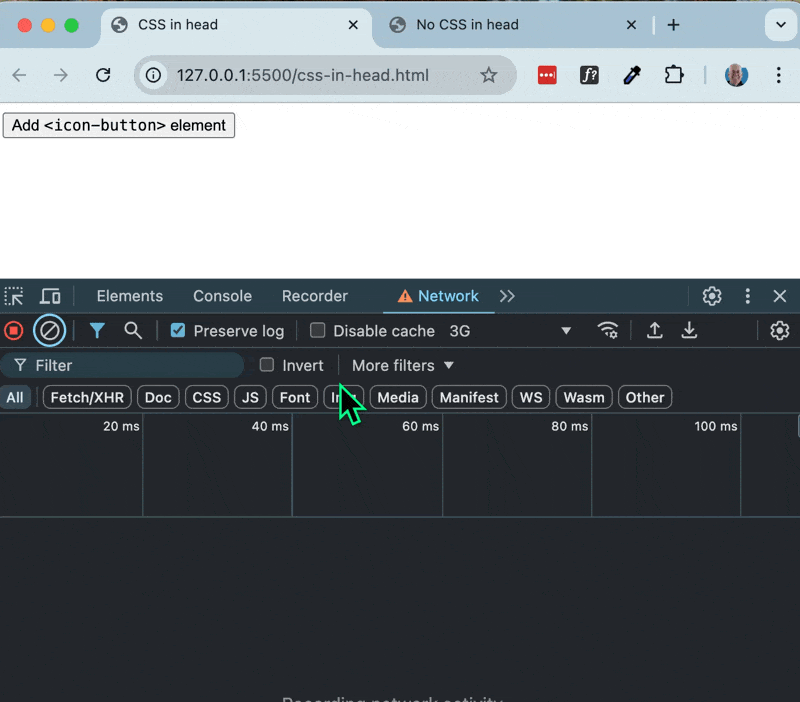
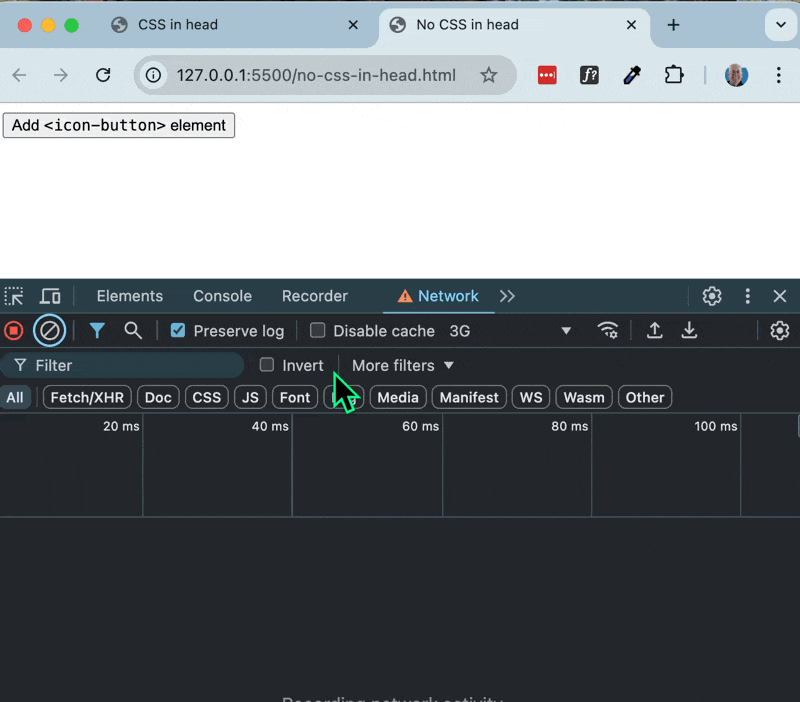
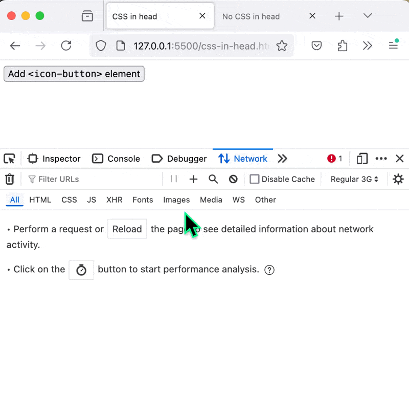
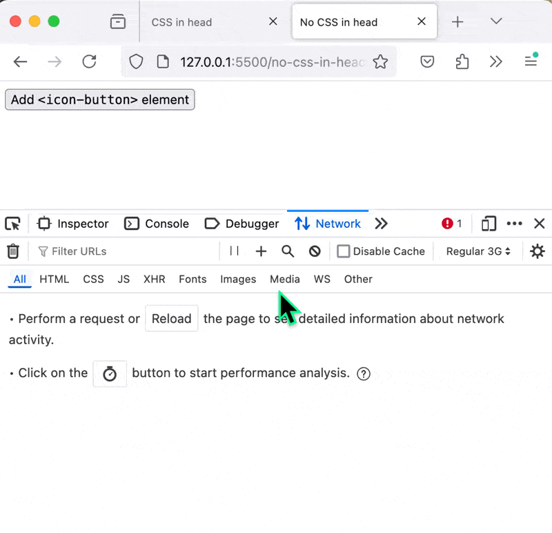

# Declarative Shadow DOM with setHTMLUnsafe()

This repo shows an example of how FOUC (Flash of Unstyled Content) can be repeatedly caused in a declarative shadow DOM (DSD) that loads its CSS with a link rel element, at least in the case where the DSD is inserted with `setHTMLUnsafe()`.

Chrome and Firefox behave differently, so this seems perhaps either a bug or differing unspecified caching behavior of CSS link rels from inside a DSD. Also, a CSS link rel in a DSD does not always render block, at least not as I wish it would.

Firefox behaves as I would expect: It caches the first CSS link rel it finds, whether found in the document head or light DOM body or in a DSD, and does not reload it when the DSD is reinserted with `setHTMLUnsafe()`. But on first load, a CSS link rel does not render block.

Chrome, however, reloads the CSS link rel each time the DSD is reinserted with `setHTMLUnsafe()`, causing a repeated FOUC, even if the CSS link rel is already in the document head or light DOM body.

In sum, these demos seem to imply there is some kind of overlapping relationship between DSD FOUC, caching, and render blocking.

## Demos

To demonstrate this behavior, I have created two examples and run both in Chrome and Firefox (throttled to 3G to emphasize the FOUC):

- css-in-head.html: In doc head: `<link rel="stylesheet" href="./icon-button.css" />`.  
- no-css-in-head.html: no css link rel in doc head.

In this repo, there is also a css-in-body.html file, which has a CSS link at the top of the body. It behaves the same in Chrome and Firefox as css-in-head.html.

Chrome, css-in-head.html 

- on each click - FOUC and CSS reload:



Chrome, no-css-in-head.html 

- on each click - FOUC and CSS reload



Firefox, css-in-head.html

- on each click - no FOUC, no CSS reload



Firefox, no-css-in-head.html

- on first click - FOUC and CSS load on first click (because `<link rel="stylesheet" href="./icon-button.css" />` was not already loaded in document head)
- on each subsequent click: no FOUC, no CSS



## How this works

When clicked, a simple Custom Element `<add-icon-button>` adds `icon-button` DSD custom elements to its container element, using `this.container.setHTMLUnsafe(iconButtonsHTML)`. 

```html
<add-icon-button>
    <template shadowrootmode="open">
        <style>
            :host {
            display: block;
            }
        </style>
        <button>Add <code>&lt;icon-button&gt;</code> element</button>
        <div id="container"></div>
    </template>
</add-icon-button>
```

Each `icon-button` has a declarative shadow DOM with a link element to a CSS stylesheet and an empty `svg` element with a red background.

```html
<icon-button>
    <template shadowrootmode="open">
        <link rel="stylesheet" href="./icon-button.css">
        <button>
            <svg style="background-color: red;"></svg>
        </button>
    </template>
</icon-button>
```

The SVG element does not have width and height attributes set on it, so when displayed without the style sheet, it will show by browser default at a size of 300px x 150px.

But in the DSD-linked icon-button.css stylesheet, the SVG's width and height is set to 24px x 24px:

```css
svg {
    width: 24px;
    height: 24px;
}
```

## So why is there repeated FOUC?

In theory, once the icon-button.css stylesheet is loaded, either from the document head or light DOM body or from a DSD inserted with `setHTMLUnsafe()`, it should be cached, and the SVG should be styled with a 24px x 24px size rather than the default 300px by 150px. 

But in practice, in Chrome the stylesheet is reloaded on each click and SVG flashes briefly at 300px x 150px for a split second before the stylesheet is reloaded.  No FOUC or CSS reloading in Firefox.

Perhaps this is a bug in how the Chrome brower reloads the stylesheet instead of caching it, as shown in Network tab in the demo above, particularly in the case of using `setHTMLUnsafe()`.

But it seems that this is related to differing interpretations of how CSS link rels should be cached in DSDs.  See a [related example](https://github.com/htmlcomponents/dsd-links) of how cache headers are handled differently in DSDs in different browsers.

Whatever the reason, Chrome's behavior is not how I want DSD to work. 

To me, Firefox seems to correctly cache the CSS link rel in the DSD and not reload it on each `setHTMLUnsafe()`.

Also, I would prefer that even in Firefox, there should be no FOUC on the first click (in no-css-in-head.html), because the CSS link rel in the DSD should render block.

## Background Assumptions

This repo was inspired by a Web Components community group [discord thread](https://discord.com/channels/767813449048260658/1315767832528551946/1315767846495715448), "Unintended and undesirable paint: FOUC, FOUCE, CLS", that attempts to summarize when and why FOUC, FOUCE, and CLS occur in Web Components and references WhatWG spec [4.2.4.3 Fetching and processing a resource from a link element](https://html.spec.whatwg.org/multipage/semantics.html#fetching-and-processing-a-resource-from-a-link-element).

Also of note is the general assumption that in a declarative shadow DOM, CSS link rels are cached and shared across all instances of the DSD, as stated in the "Declarative Shadow DOM" article on [web.dev](https://web.dev/articles/declarative-shadow-dom#server-rendering_with_style):

> "Styles specified this way are also highly optimized: if the same style sheet is present in multiple Declarative Shadow Roots, it is only loaded and parsed once. The browser uses a single backing CSSStyleSheet that is shared by all of the shadow roots, eliminating duplicate memory overhead."

Maybe this is a bug or inconsistent interpretation of caching rules around CSS links, on the fragile assumption that cached CSS links in DSD behave as-if render blocking, even though caching is not consistent.